# Photogrammetry and georegistration tools for Parrot drone videos

This is a set of python scripts  and c++ programs used to construct a depth validation set with a Lidar generated point cloud.
For a brief recap of what it does, see section [How it works](#how-it-works)

## Table of contents

* [Software Dependencies](#software-dependencies)
* [Hardware Dependencies](#hardware-dependencies)
* [How it works](#how-it-works)
* [Step by step guide](#usage)
* [Special case : adding new images to an existing constructed dataset](#special-case-adding-new-images-to-an-existing-dataset)
* [Using the constructed dataset for evaluation](#evaluation)
* [Detailed method with the manoir example](#detailed-method-with-the-manoir-example)
* [TODO](#todo)


## Software Dependencies

*Note*: There is a dockerfile in order to construct a docker image that automatically complies with all the software dependencies. You can just construct it with

```
docker build . -t my_image
```

These are the used tools, make sure to install them before running the scripts.

 - [CUDA](https://developer.nvidia.com/cuda-downloads) (version : 10+)
 - [OpenCV](https://opencv.org/) (version, 4.0.0+)
 - [ETH3D Dataset-pipeline](https://github.com/ETH3D/dataset-pipeline) (version : master)
 - [Pytorch](https://pytorch.org/) (version, 1.7.0+)
 - [COLMAP](https://colmap.github.io/) (version : master)
 - [PDrAW from AnafiSDK](https://developer.parrot.com/docs/pdraw/) (version : master)

Apart from CUDA, which you need to install by yourself, you can use the help script `install_dependencies.sh` to install them on ubuntu 20.04.

For PDrAW, there should be a `native-wrapper.sh` file that you to keep a track of. It's usually in `groundsdk/out/pdraw-linux/staging/native-wrapper.sh`(see [here](https://developer.parrot.com/docs/pdraw/installation.html))

For COLMAP, you will need a vocab tree for feature matching. You can download them at https://demuc.de/colmap/#download . In our tests, we took the 256K version.

## Hardware dependecies

To recreate the results of the study, you will need these hardware pieces :
 - Parrot Anafi
 - DJI Matrice 600
 - Velodyne Puck VLP16

Note that for our study, we provided the Anafi drone (\~700€), and the point cloud was created by a private company (\~3500€ for the whole scan process)


# How it works

Here are the key steps of the dataset creation :
See [Detailed method with the manoir example](#detailed-method-with-the-manoir-example) for a concrete example with options used.

1. Data acquisition on a particular scene
    - Make a photogrammetry flight plan with any drone, You can use e.g. the Anafi with the Pix4D capture app (it's free). It is important that pictures have GPS info in the exif
    - Make some natural flights in the same scene, use either a Bebop2 or a Anafi to be able to use the PDraw tool. In theory this is possible to adapt the current scripts to any IMU-GPS-powered camera.
    - Make a Lidar scan of this very scene, and clean the resulting 3D point cloud : this is a crucial part as Lidar data will be assumed perfect for the rest of the workflow. You need to also note the projection system used (e.g. `EPSG 2154`) for geo registration. The file will a priori be a `.las` file with float64 values.

2. Convert the `.las` float64 point cloud into a `.ply` float32
    - As 3D values are global, x and y will be huge. You need to make the cloud 0-centered by subtracting its centroid to it.
    - The centroid needs to be logged somewhere for future frame registration
    - This step is done by the script `las2ply.py`

3. Extract optimal frames from video for a thorough photogrammetry that will use a mix of pix4D flight plan pictures and video still frames.
    - The total number of frame must not be too high to prevent the reconstruction from lasting too long on a single desktop (we recommand between 500 an 1000 images)
    - At the same time, extract if possible information on camera parameters to identify which video sequences share the same parameters (e.g 4K videos vs 720p videos, or different levels of zooming)
    - This step is done by the script `videos_to_colmap.py` (See Step by step guide, Step 5)

4. Georeference your images.
    - For each frame with *GPS* position, convert them in *XYZ* coorindates in the projection system used by the Lidar point cloud (Here, EPSG:2154 was used)
    - Substract to these coordinates the centroid that logged when converting the LAS file to PLY.
    - Log image filename and centered *XYZ* position in a file for georegistration of the reconstruction point cloud
    - This step is also done by the script `videos_to_colmap.py` (See Step by step guide, Step 5)

4. Generate sky maps of your drone pictures to help the photogrammetry filter out noise during matching (Step 6)
    - Use a Neural Network to segment the drone picture and generate masks so that the black areas will be ignored
    - This is done with the script `generate_sky_masks.py`

3. Perform a photogrammetry on your pictures (See Step by step guide, Steps 6 - 7 - 8)
    - The recommended tool is COLMAP because further tools will use its output format
    - You should get a sparse 3D model, exhaustive enough to : 
        - Be matched with the Lidar Point cloud
        - Localize other video frames in the reconstruction

4. Change reconstructed point cloud with shift and scale to match Lidar point cloud
    - See [here](https://colmap.github.io/faq.html#geo-registration) for point cloud georegistration with colmap (See Step by step guide, Step 9)

5. Video Localization :
    - Continue the photogrammetry with video frames at a low fps (we took 1fps). We do this in order to keep the whole mapping at a linear time (See Step by step guide, Step 10.3)
    - Merge all the resulting models into one full model with thorough photogrammetry frames and all the 1fps frames (See Step by step guide, Step 10.)
    - Finish registering the remaning frames. For RAM reasons, every video is divided into chunks, so that a sequence registered is never more than e.g. 4000 frames (See Step by step guide, Step 10.)
    - Filter the final model at full framerate : remove points with absurd angular and translational accleration. Interpolate the resulting discarded points (but keep a track of them). This is done in the script `filter_colmap_model.py` (See Step by step guide, Step 10.)

6. Densify the resulting point cloud with COLMAP (see [here](https://colmap.github.io/tutorial.html#dense-reconstruction))
    - Export a PLY file along with the VIS file with `colmap stereo_fusion`

7. Match the Lidar Point cloud and full reconstruction point cloud together with ICP.
    - The georegistration of the reconstructed point cloud should be sufficient to get a good starting point.
    - By experience, the best method here is to use CloudCompare, but You can use ETH3D or PCL to do it
    - The resulting transformation matrix should be stored in a TXT file, the same way cloudcompare proposes to do it

8. Construct a PLY+VIS file pair based on lidar scan
    - The PLY file is basically every lidar point
    - The VIS file stores frames from which point is visible : we reuse the PLY+VIS from step 6, and assume a lidar point has the same visibility as the closest point in the denified reconstructed point.

9. Run the delauney mesher tool from COLMAP to construct an occlusion mesh

10. Construct the Splats with ETH3D

11. Construct the ground truth Depth with ETH3D

12. Visualize and Convert the resulting dataset to match the format of a more well known dataset, like KITTI.


## Usage

It is expected that you read the COLMAP tutorial in order to understand key COLMAP concepts and data structure : https://colmap.github.io/tutorial.html

### Working directories

You will be working with 3 different folders :
 - Input directory : Where you store your acquired data : Lidar point clouds, photogrammetry pictures and videos
 - Workspace : Data from input directory will be copied into this directory so that COLMAP can run several photogrammetry tasks
 - Output folder: Where the processed data will be stored? This will be the biggest directory.

#### Input directory

Structure your input folder so that it looks like this:

```
Input
├── Pictures
│   ├── folder1
│   │   ├── subfolder1
│   │   │   ├── 01.jpg
│   │   │   └── ...
│   │   ├── subfolder2
│   │   └── ..
│   └── folder2
├── Videos
│   └── no_groundtruth
└── Lidar
```

- `Pictures` contains the photogrammetry pictures. They can be in jpeg or RAW format. The subfolder means a shared camera calibration. If two pictures are taken with the same camera but with different zoom levels, they need to be in separate folders.
- `Videos` containes the videos you took which will be converted into frames and then used in the photogrammetry process.
    * `no_groundtruth` contains the videos you want to use for the whole model reconstruction (the thorough photogrammetry step), but you don't want the whole video to be localized. Thus, no depth ground truth will be generated for these videos.
    * Other videos will be used for photogrammetry AND for localization, and depth and odometry will be produced for every frame of the video.
- `Lidar` contains the lidar models. They can be `LAS` files or `PLY` files. In the case your point clouds are geo-referenced, you need to know what projection system was used in order to compute picture position with respect to the clouds using GPS coordinates.

#### Workspace directory

Your workspace (which is different from the input folder !) will be used throughout your whole dataset creation pipeline. It should be stored on a SSD and is designed this way :

```
Workspace
├── Lidar
├── COLMAP_img_root
│   ├──Indivudal_pictures
│   │   ├── folder1
│   │   ├── folder2
│   │   └── ...
│   └──Videos
│       ├── resolution1
│       │   ├── video1
│       │   └── ...
│       ├── resolution2
│       └── ...
├── Masks
│   └── Same structure as 'COLMAP_img_root' folder
├── Thorough
│   ├── 0
│   ├── 1
│   ├── ...
│   ├── georef
│   ├── georef_full
│   └── dense
├── Video_reconstructions
│   ├── Same structure as 'COLMAP_img_root/Videos' folder
│   ├── resolution1
│   │   └── video1
│   │       ├── lowfps
│   │       ├── chunk_0
│   │       ├── chunk_1
│   │       ├── ...
│   │       └── final
│   └── ...
├── scan_thorough.db
├── lidar.mlp
└── aligned.mlp
```

- `Lidar` will store the point clouds converted and centered from LAS point clouds
- `COLMAP_img_root` is the folder COLMAP will make its picture paths relative from. In every COLMAP command, it is always indicated with the option `--image_path`. Obviously, that is also where we store the pictures COLMAP will use.
    * `Individual pictures` contains the pictures that were not extracted from a video, e.g. from a photogrammetry flight plan. Subfolders can be used. You need to ensure that for pictures in the same sub folders share the exact same camera calibration : image size, focal length, distorsion.
    * `Videos` containes pictures extracted from videos. In each video folder, in addition to the video frame, a `metadata.csv` file is stored in order to keep metadata, such as frame timestamp, image size, image calibration (if available, this is the case for Anafi videos), image position from GPS, and colmap database id. Note that we don't need to stores all the video frames in this folder at the same time. We only need a subset most of the time when mapping the whole reconstruction. When localizing the video frames, wall the frame sare in the directory, but you can remove them (apart from the subset) as soon as you are finished with localizing the video, and copy the frames in the output folder (see below)
- `Masks` is a mirror of `COLMAP_img_root` and for each image, there is a black and white picture used discard parts of the images for feature points computation. See https://colmap.github.io/faq.html#mask-image-regions
- `Thorough` is the output of the first photogrammetry, the one that will try to reconstruct the whole model with a subset of the images we acquired, which will then be used to localized remaining images, as well as localize the Lidar point cloud with respect to the images.
    * `0`, ... , `N` are the folder containing sparse models reconstructed by COLMAP with the function `colmap mapper`. See https://colmap.github.io/tutorial.html#sparse-reconstruction
    * `georef` is the folder containing the geo-referenced model. When GPS is available, we use it to have a first guess to register the reconstructed model with the Lidar point cloud. Note that this also apply the right scale to the model. See https://colmap.github.io/faq.html#geo-registration
    * `georef_full` is the folder containing the geo-referenced model, augmented with additional frames from videos localization.
    * `dense` is the folder containing the dense mode. See https://colmap.github.io/tutorial.html#dense-reconstruction
- `Video_reconstructions` is the folder where we store the reconstruction for each video. It is based on the `georef` model. We then add a subset of the video frames (usually 1 fps) with the `colmap mapper`, augment the `georef_full`with it (see https://colmap.github.io/faq.html#merge-disconnected-models), and localize the rest of the frames. Note that once all frames are localized, you no longer use the reconstruction until ground truth creation, so you can store it in the output folder as soon as you are finished with your video
    * `lowfps` contains the model with the subset of frames
    * `chunk_0` to `chunk_N` contains the localized frames (but they do not contribute to the reconstruction). We cut the video in several chunks if the video is too long (and thus needs too much RAM)
    * `final` contains a COLMAP model with only the frames of the very video we want to localize. Everything else than images localization (3D points, 2D feature points for each image, irrelevant camera models) is removed from the model.
- `scan_thorough.db` is the database file used by COLMAP for the thorough reconstruction. Note that it can become quite big, that's why it does not contain feature for all the video frames but only a subset.
- `lidar.mlp` is the MeshLabProject containing all the PLY files from Lidar scans. The meshlab project stores multiple PLY files and transformation information (in a 4x4 matrix) in a xml-like file.
- `aligned.mlp` is the MeshLabProject after the Lidar point clouds (i.e. `lidar.mlp`) have beed registered with respect to the photogrammetry pointcloud. The transformations are the ones to apply to the PLY file in order to be aligned to the COLMAP output.

#### Output directories

You output directory is divided in 2 parts : 
- Raw output directory, which will contain the full size images, with the depth maps generated by ETH3D
- Converted output directory, which will contain the resized images, with depths stored in numpy files, along with videos for visualization purpose.


```
Raw_output_directory
├── calibration
├── ground_truth_depth
│   ├── video1
│   ├── video2
│   └── ...
├── COLMAP_img_root
│   └── Same structure as 'Workspace/COLMAP_img_root' folder
├── models
│   └── Same structure as 'Workspace/Videos_reconstructions' folder
├── occlusion_depth
│   ├── video1
│   ├── video2
│   └── ...
└── points
```

- `calibration` Byproduct of ETH3D `GroundTruthCreator` : where the colmap model used for the current video is stored. Overwritten for every video. All COLMAP models are already stored in the folder `models`.
- `points` Another byproduct of ETH3D `GroundTruthCreator` : Lidar point cloud where points not seen by more than 2 images are discarded. Note that as in `calibration`, the file is overwritten for every video.
- `ground_truth_depth` Folder where ETH3D `GroundTruthCreator` stored raw depth maps. Note that directory tree is not preserved, every video folder stem is stored in the root of the folder.
- `occlusion_depth` Same as `ground_truth_depth` but for occlusion depth maps instead of depth maps. Note that outputing this occlusion depth is optional and only serves visualization purpose for the conveted dataset.
- `COLMAP_img_root` is a clone of  `Workspace/COLMAP_img_root`. Contrary to the one in workspace, tt stores ALL the video frames so it can be very heavy.
- `models` is a clone of `Workspace/Video_reconstructions`, it contains all the models that were used for video localization.

```
Converted_output_directory
├── dataset
│   ├── resolution1
│   │   ├── video1
│   │   │    ├── poses.txt
│   │   │    ├── intrinsics.txt
│   │   │    ├── interpolated.txt
│   │   │    ├── not_registered.txt
│   │   │    ├── camera.yaml
│   │   │    ├── 0001.jpg
│   │   │    ├── 0001_intrinsics.txt
│   │   │    ├── 0001_camera.yaml
│   │   │    ├── 0001.npy
│   │   │    ├── 0002.jpg
│   │   │    └── ...
│   │   └── ...
│   ├── resolution2
│   ├── ...
│   └── individual_pictures
│       ├── folder1
│       ├── folder2
│       └── ...
└── visualization
    ├── resolution1
    │   ├── video1.mp4
    │   ├── video2.mp4
    │   └── ...
    ├── resolution2
    ├── ...
    └── individual_pictures
        ├── folder1
        │   ├── 0001.png
        │   └── ...
        ├── folder2
        └── ...
```


- `dataset` contains the information that will be used for the actual evaluation. For every video, we have a folder containing :
    * `poses.txt` for frames odometry. It is a list of lines of 12 float numbers, representing the 4x4 transformation matrix, the first matrix is always identity. This format is the same KITTI odometry. Non localized frames have a transformation matrix of `NaN` values.
    * `interpolated.txt` is a list of all the fram paths that have an interpolated odometry. That way, depth are invalid, but odometry can be used to test depth algorithm that needs frame odometry.
    * `not_registered.txt` is a list of all the fram paths that are not localized. They thus cannot be used for depth evaluation nor for odometry.
    * `intrinsics.txt` *(only if all the frames share the same camera)* contains the intrinsics 3x3 matrix in a txt file (does not contains distortion parameters)
    * `camera.yaml` *(only if all the frames share the same camera)* containes the camera parameters in COLMAP format, with distortions.
    * For every frame:
        * `{name}.jpg`
        * `{name}.npy`
        * `{name}_intrinsics.txt` and `{name}_camera.yaml`: only if frames don't share the same camera, same `intrinsics.txt` and  `camera.yaml` above.
    * Each folder stem in the idividual picture directry is treated as a video
- `visualization` contains images for vizualisation. Each video has a correspondign mp4 file. Individual pictures have a corresponding image file.

### How to read visualization

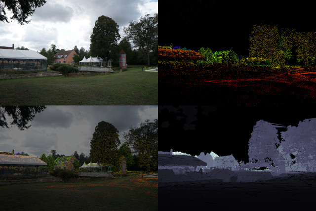

Image is divided in 4 parts :

```
┌───┬───┐
│ A │ B │
├───┼───┤
│ C │ D │
└───┴───┘
```

 - `A` is raw image
 - `B` is normalized depth map. It follows [OpenCV's Rainbow colormap](https://docs.opencv.org/master/d3/d50/group__imgproc__colormap.html#gga9a805d8262bcbe273f16be9ea2055a65af7f0add024009b0e43f8c83f3ca0b923). Note that OpenCV's rainbow is NOT the same as matplotlib's rainbow_gist.
 - `C` is `A + B / 2`. It helps inspecting that depth and image are not shifted apart.
 - `D` is normalized occlusion depth map. It follows Matplotlib's Bone colormap. Its the same as [OpenCV's Bone colormap](https://docs.opencv.org/master/d3/d50/group__imgproc__colormap.html#gga9a805d8262bcbe273f16be9ea2055a65a91d58e66f015ea030150bdc8545d3b41) See https://matplotlib.org/3.1.0/tutorials/colors/colormaps.html

Note that when frame localization is interpolated, a 5 pixels wide orange frame is visible at the edge of the picture.


### Running the full script

You can run the whole script with ```python main_pipeline.py```. If you don't have a lidar point cloud and want to use COLMAP reconstructed cloud as Groundtruth, you can use ```python main_pipeline_no_lidar.py``` which will be very similar, minus point cloud cleaning and registration steps.

Example command :

```
python main_pipeline.py --input_folder /media/user/data/input_dataset/ --raw_output_folder /media/user/data/ground_truth_raw/ --converted_output_folder /media/user/data/ground_truth_converted/ --workspace ../workspace --total_frames 600 --SOR 10 5 --eth3d ../dataset-pipeline/build/ --nw ../AnafiSDK/out/pdraw-linux/staging/native-wrapper.sh --generic_model OPENCV --max_num_matches 25000 --match_method exhaustive --multiple_models --registration_method interactive --mesh_resolution 0.1 --splats --splat_threshold 0.05 --lowfps 1 --save_space --log out.log --system epsg:3949 -vv
```

#### Parameters breakdown

All the parameters for `main_pipeline.py` are defined in the file `cli_utils.ply` and can be retrieved with `python main_pipeline.py -h`. You will find below a summary :

1. Main options
    * `--input_folder` : Input Folder with LAS/PLY point clouds, videos, and images, defined above
    * `--workspace` : Path to workspace where COLMAP operations will be done. It needs to be on a SSD, and size needed depends on video size, but should at least be 20 Go.
    * `--raw_output_folder` : Path to output folder for raw depth maps. Must be very big, especially with 4K videos. for 4K30fps video, count around 60Go per minute of video.
    * `--converted_output_folder` : Path to output folder for converted depth maps and visualization. Must be big but usually smaller than raw output because depth map is still uncompressed, but downscaled.
    * `--show_steps` : If selected, will make a dry run just to list steps and their numbers.
    * `--skip_step` : Skip the selected steps. Can be useful an operation is done manually)
    * `--begin_step` : Skip all steps before this step. Useful when the script failed at some point
    * `--resume_work` : If selected, will try to skip video aready localized, and ground truth already generated
    * `--inspect_dataset` : If selected, will open a window to inspect the dataset at key steps. See https://github.com/ETH3D/dataset-pipeline#dataset-inspection
    * `--save_space` : If selected, will try to save space in workspace by only extracting needed frames and removing them as soon as they are no longer needed. Strongly advised.
    * `--vid_ext` : Video extensions to scrape from input folder. By default will search for `mp4` and `MP4` files
    * `--pic_ext` : Same as Video extensions, but for Image. By default will search for `jpg`, `JPG`, `png`and `PNG` files.
    * `--raw_ext` : Same as Video extensions, but for RAW image. By default will search for `ARW`, `NEF` and  `DNG` files.

2. Executable files
    * `--nw` : Native wrapper location. See https://developer.parrot.com/docs/pdraw/installation.html#run-pdraw
    * `--colmap` : Colmap exec location. Usually just `Colmap` if it has been installed system-wide.
    * `--ffmpeg` : ffmpeg exec location. Usually just `ffmpeg` if it has been installed system-wide.
    * `--eth3d` : ETH3D dataset pipeline exec files folder location. Usually at `dataset-pipeline/build/`.
    * `--pcl_util` : PCL util exec files. Usually at `pcl_util/build` (source in this repo)
    * `--log` : If set, will output stdout and stderr of these exec files to a log file, which can be read from anther terminal with `tail`.

3. Lidar point cloud preparation
    * `--pointcloud_resolution` : If set, will subsample the Lidar point clouds at the chosen resolution.
    * `--SOR` : Satistical Outlier Removal parameters. This accepts 2 arguments : Number of nearest neighbours and max relative distance to standard deviation. See https://pcl.readthedocs.io/projects/tutorials/en/latest/statistical_outlier.html
    * `--registration_method` : Method use for point cloud registration, chose between "simple", "eth3d" and "interactive" ("simple" by default). See Manual step by step : step 11')

4. Video extractor
    * `--total_frames` : Total number of frames that will be used for the first thorough photogrammetry. By default 500, keep this number below 1000.
    * `--orientation_weight` : Weight applied to orientation during optimal sample. Higher means two pictures with same location but different orientation will be considered further apart.
    * `--resolution_weight` : Same as orientation, but with image size.
    * `--max_sequence_length` : COLMAP needs to load ALL the feature matches to register new frames. As such, some videos are too long to fit in RAM, and we need to divide the video in Chunks that will treated separately and then merged together. This parameter is the number max of frames for a chunk. Ideal value is around 500 frames for 1Go of RAM, regardless of resolution.
    * `--num_neighbours` : number of frames overlapping between chunks. This is for merge purpose.
    * `--system` : coordinates system used for GPS, should be the same as the LAS files used.
    * `--lowfps`: framerate at which videos will be scanned WITH reconstruction. 1fps by default
    * `--include_lowfps_thorough` : if selected, will include videos frames at lowfps for thorough scan (longer). This can be useful when some videos are not GPS localized (e.g. handhel camera) and are still relevant for the thorough photogrammetry.

5. Photogrammetry
    * `--max_num_matches` : Max number of matches, lower it if you get GPU memory error.
    * `--vocab_tree` : Pah to vocab tree, can be downloaded [here](https://demuc.de/colmap/#download)
    * `--multiple_models` : If selected, will let colmap mapper do multiple models. The biggest one will then be chosen
    * `--more_sift_features` : If selected, will activate the COLMAP options ` SiftExtraction.domain_size_pooling` and `--SiftExtraction.estimate_affine_shape` during feature extraction. Be careful, this does not use GPU and is thus very slow. More info : https://colmap.github.io/faq.html#increase-number-of-matches-sparse-3d-points
    * `--add_new_videos` : If selected, will skip the mapping steps to directly register new video with respect to an already existing colmap model.
    * `--filter_models` : If selected, will filter video localization to smooth trajectory
    * `--stereo_min_depth` : Min depth for PatchMatch Stereo used during point cloud densification
    * `--stereo_max_depth` : Same as min depth but for max depth.

6. Occlusion Mesh
    * `--normals_method` : Method used for normal computation between radius and nearest neighbours.
    * `--normals_radius` : If radius method for normals, radius within which other points will be considered neighbours
    * `--normals_neighbours` : If nearest neighbours method chosen, number of neighbours to consider. Could be very close or very far points, but has a constant complexity.
    * `--mesh_resolution` : Mesh resolution for occlusion in meters. Higher means more coarse. (default 0.2, i.e. 20cm)
    * `--splats` : If selected, will create splats for points in the cloud that are far from the occlusion mesh.
    * `--splat_threshold` : Distance from occlusion mesh at which a splat will be created for a particular point (default, 10cm)
    * `--max_splate_size` : Splat size is defined by mean istance from its neighbours. You can define a max splat size for isolated points which otherwise would make a very large useless splat. If not set, will be `2.5*splat_threshold`.

7. Ground truth creation
    * `--eth3d_splat_radius` : Splat radius for occlusion mesh boundaries, radius of area (in meters) which will be defined as invalid because of occlusion uncertainty, see `splat_radius` option for ETH3D. Thumb rule here is that it should be around your point cloud precision. (default 0.01, i.e. 1cm)

### Manual step by step

This will essentially do the same thing as the script, in order to let you change some steps at will.

1. Point cloud preparation

    ```
    python las2ply.py Input/Lidar/cloud.las \
    --output_folder Workspace/Lidar
    ```

    This will save a ply file along with a centroid file
     - `Workspace/Lidar/cloud.ply`
     - `Workspace/Lidar/cloud_centroid.txt` This file will be used 

    *Note on centroid* : Contrary to LAS files which are 64bit floats, PLY is used with 32bit foats, which cannot store large numbers with high values. The centroid is there to make every geo-referenced position (which can be as high as 20,000 km), be it from LAS file or from GPS coordinates centered around zero and thus usable in float32. This file will thus be used when extracting GPS metadata from pictures or videos and converting the values in `XYZ` coordinates relative to your point cloud.

    Note that this also work for ply files, but most ply files are already centered around zero, so you can instead just copy the ply file and optionally write a centroid file with `0\n0\n0\n` inside.


2. Point Cloud Cleaning
    For each ply file :

    ```
    ETHD3D/build/PointCloudCleaner \
    --in Workspace/Lidar/cloud.ply \
    --filter 5,10
    ```
    (local outliers removal, doesn't necessarily remove isolated points)
    or
    ```
    pcl_util/build/CloudSOR \
    --input Workspace/Lidar/cloud.ply \
    --output Workspace/Lidar/cloud_filtered.ply \
    --knn 5 --std 6
    ```

3. Meshlab Project creation
    This step will construct a MeshLabProject file. It stores multiple PLY files and transformation information (in a 4x4 matrix) in the same file. During creation, every point cloud has identity for transformation.
    ```
    python meshlab_xml_writer.py create \
    --input_models Workspace/Lidar/cloud1_filtered.ply [.. Workspace/Lidar/cloudN_filtered.ply] \
    --output_meshlab Workspace/lidar.mlp
    ```

    Optionally, if we have multiple lidar scans, we can run a registration step with ETH3D

    This will run an ICP on the different ply models and store the resulting transformations in the `lidar.mlp` file.

    ```
    ETHD3D/build/ICPScanAligner \
    -i Workspace/lidar.mlp \
    -o Workspace/lidar.mlp
    --number_of_scales 5
    ```

4. Photogrammetry pictures preparation.

    This step can be skipped if there are only videos. It consists in 4 substeps

    1. Convert all your frames to either jpg or png and copy them to the folder `Workspace/COLMAP_img_root/individual_pictures`.
    Frames sharing the same subfolder MUST have the same camera calibration, i.e. taken from the same camera, with the same lense, and the same zoom level. It is advised to try to keep as few camera models as possible in order to improve COLMAP stability.

    2. (Optional) Generate sky masks in order to avoid using keypoints from clouds. See https://colmap.github.io/faq.html#mask-image-regions
    ```
    python generate_sky_masks.py \
    --img_dir Workspace/COLMAP_img_root \
    --colmap_img_root Workspace/COLMAP_img_root \
    --mask_root Workspace/Masks \
    --batch_size 8
    ```
     - This script will find recursively all image files (jpg or png) in folder given to `--img_dir` and create black and white mask images to prevent COLMAP from find feature points in the sky (where the clouds are moving).
     - `--colmap_img_root` and `mask_root` are given so that the mask for the image file located at e.g. `{--colmap_img_root}/relative_path/image.jpg` will be saved under the name `{--mask_root}/relative_path/image.jpg.png`.
     - Note that COLMAP is flexible to some images corresponding mask, and some images without. As such, you can run the script to only a subfolder of `Workspace/COLMAP_img_root`. This is especially interesting if the dataset has indoor videos where sky is never on screen and thus running script would only generate false positives.

    3. Run the feature extractor COLMAP command.
    ```
    colmap feature_extractor \
    --database_path Workspace/thorough_scan.db \
    --image_path Workspace/COLMAP_img_root \
    --ImageReader.mask_path Workspace/Masks \
    --ImageReader.camera_model RADIAL \
    --ImageReader.single_camera_per_folder 1 \
    ```
     - `--database_path` is the Database file that COLMAP will use throughout the whole photogrammetry process.
     - `--ImageReader.camera_model` is on of the camera models compatible with COLMAP. See https://colmap.github.io/cameras.html
     - `--ImageReader.single_camera_per_folder` makes COLMAP set every image in the same forlder to share the same camera parameters this will greatly improve the photogrammetry stability. This is only relevant if your pictures are indeed from the same camera parameters (including zoom).

    We don't explicitely need to extract features before having video frames, but this will populate the `/path/to/scan.db` file with the photogrammetry pictures and corresponding id that will be reserved for future version of the file.

5. Video frames addition to COLMAP db file
    ```
    python video_to_colmap.py \
    --video_folder Input/Videos \
    --system epsg:2154 \
    --centroid_path Workspace/Lidar/cloud_centroid.txt \
    --colmap_img_root Workspace/COLMAP_img_root \
    --nw /path/to/anafi/native-wrapper.sh \
    --fps 1 \
    --total_frames 1000 \
    --max_sequence_length 4000 \
    --save_space \
    --thorough_db Workspace/scan_thorough.db
    ```
     - `--video_folder` is the folder where you stored all your videos in MP4 files. For other video file formats, you can use the option `--vid_ext .avi` for e.g. also taking the `avi` files. The format must be readable by ffmpeg. See https://ffmpeg.org/ffmpeg-formats.html#Demuxers
     - `--system` is the gps coordinates system parameter (here `epsg:2154`). It is the one used in the LAS point cloud. The geo localized frame will then be localized inside the point cloud, which will help register the COLMAP reconstructed point with the Lidar PointCloud. See more info [here](https://en.wikipedia.org/wiki/Spatial_reference_system). It must be compatible with [Proj](https://proj.org).
     - `--nw` is the file we use to access PDraW tools, including `vmeta-extract` which will convert Anafi metadata into a csv file. See https://developer.parrot.com/docs/pdraw/userguide.html#use-the-pdraw-program
     - `--centroid_path` is the file that was created in the first step when LAS files were converted into PLY files.
     - `--fps` is the framerate at which videos will be subsampeld when running the mapper at step 10.
     - `--save_space` indicates that not all frames will be extracted from the videos, as it can become quite heavy. Only the frames that are  When localizing the video (see step 10), you will have to extract the whole video, but until this step it is not needed.
     ----
    What this script does :
     - For each MP4 file found in the folder `--video_folder`:
         1. Create the folder `{--colmap_img_root}/Videos/{resolution}/{video_name}` where we will store files related to this video frame. For example with the example command above and a full HD video named `video.mp4`, the script will create the folder `Workspace/COLMAP_img_root/Videos/1920x1080/video`
         2. Extract metadata if possible (see note below), and save in the CSV file `metadata.csv` in the folder created. See second note below for expected generic metadata. GPS data is converted to XYZ using the coordinate system given in `--system`. For videos without metadata, at least frame number, frame name, framerate and frame size are stored.
         3. Use the metadata to select a spatially optimal subset of frames from the full video for a photogrammetry with `--total_frames` pictures (1000 frames in this example). 1000 pictures might be overkill for scenes with low complexity (e.g. only one building), you can easily reduce it to 500 if reconstruction is too slow.
          * The optimal subset is obtained by taking all videos with XYZ positions and making a subset with [K-Means](https://scikit-learn.org/stable/modules/generated/sklearn.cluster.KMeans.html). It is better than just taking frames at a low framerate, because camera motion is not  necessarily homogeneous (especially for drone who are often on a fixed point) and we avoid unecessarily sampling multiple almost identical frames.
          * If orientation is available in a quaternion QwQxQyQz, K-Means are applied on the 6D cloud `[X,Y,Z,Qx,Qy,Qz]`. That way, frames that share the same position but have different orientation, can be both sampled.
          * The K-means is weighted A quality index is also applied (given by `width * height / framerate`), in order to use more frames of better quality. This is used for example with Anafi videos, where high framerate videos tend to have lower quality for the same resolution.
          * If no GPS is available, but relative position is available (e.g. indoor flight data), each sequence will be optimally sampled without comparing it to other video sequences.
         4. populate the database given in `--thorough_db` with these new entries with the right camera parameters (e.g. PINHOLE camera for Anafi videos, all videos taken with the same drone and the same zoom level will share the same camera parameters). If no metadata is available, we adopt the same policy as COLMAP during feature extraction when using option `--ImageReader.single_camera_per_folder` (see step 4).
         5. Divide video into chunks of size `--max_sequence_length` with corresponding list of filepath so that we don't deal with too large sequences during the video localization step (see step 10). Each chunk will have the list of frames stored in a file `full_chunk_N.txt` inside the video folder.
         6. Extract frames from the videos and save it to the folder `{--colmap_img_root}/Videos/{resolution}/{video_name}`. if `--save_space` is selected, only extract sampled frames (use for Spar reconstruction) and frames at framerate `--fps` (used for Reconstruction densification, i.e. Multi view stereo)
         7. Create `1+n` txt files with list of file paths and save it to the same folder as the frames
            * `lowfps.txt` : list of frames at framerate approximatively `--fps`
            * `full_chunk_{n}.txt` : list of frames for each of `n` chunk into which the video was divided.
            The `georef.txt` is unused. It contains file paths and XYZ coordinates of sampled frames + video frames at low framerate. See below.
     - Create two txt files with list of file paths and save it at the root of `--colmap_img_root` :
        * `video_frames_for_thorough_scan.txt` : all images used in the first thorough photogrammetry. This will be used for feature extraction in order to not extract every feature from every frame. Indeed, the matching step in COLMAP will try to match EVERY frame in its database, and thus if we extract features from all frames, w will match every video frame (potentially thousands) which not what we want because otherwise the reconstruction would be unnecessarily long.
        * `georef.txt` : all images with XYZ position from GPS, with system and minus centroid of Lidar file. This will be used at the georeferencing step. See https://colmap.github.io/faq.html#geo-registration. This will provide a first transformation estimation for the geo registered Lidar cloud. In the case XYZ data is available without GPS (e.g. indoor flight data), the video sequence with the largest radius covered is used as "valid GPS". That way, even if the geo-registered model is not a good transformation estimate for Lidar point cloud, we at least have a good scale estimate.
     - Create a COLMAP model (`images.bin`, `points3D`, `cameras.bin`) at the root of `{--colmap_img_root}/Videos` without any 3D points, but with cameras specifications and images localizations from metadata. It can be used for inspection purpose (You will need an X server). See https://colmap.github.io/gui.html
     ```
     colmap gui \
     --import_path Workspace/COLMAP_img_root/Videos \
     --database_path Workspace/scan_thorough.db \
     --image_path Workspace/COLMAP_img_root
     ```
 ----
    *Notes*
     - This script is designed to circumvent the fact that COLMAP will try to compute the features of all the images in the database, will try to match all the feature vectors in the database, and try to map a reconstruction with all the matches. As such, if we add all the video frames to the databse we won't be able to run the photogrammetry with only a subset of the video frames. In order to do so, we add all the frames to a fictive database and note the image id numbers in the video metadata for later use. We then construct a small database with only the frames we want. And each time we want to add frames to this database, we add it with the id numbers that was generated for the fictive database, with the right camera id. See https://colmap.github.io/tutorial.html#database-management
     - This script is initially intended to be used for Anafi video, with metadata directly embedded in the video feed. However, if you have other videos with the same kind of metadata (GPS, timestamp, orientation ...), you kind manually put them in a csv file that will be named `[video_name]_metadata.csv` alongside the video file `[vide_name].mp4`. One row per frame, obligatory fields are :
        - `camera_model` : See https://colmap.github.io/cameras.html
        - `camera_params` : COLMAP format : tuples beginning with focal length(s) and then distortion params
        - `x`, `y`, `z` : Frames positions : if not known, put nan
        - `frame_quat_w`, `frame_quat_x`, `frame_quat_y`, `frame_quat_z` : Frame orientations : if not known, put nan
        - `location_valid` : Whether `x,y,z` position should be trusted as absolute with respect to the point cloud or not. If `x,y,z` positions are known but only reltive to each other, we can still leverage that data for COLMAP optimal sample, and later model rescaling after thorough photogrammetry.
        - `time` : timestamp, in microseconds.
        An exemple of this metadata csv generaton can be found with `convert_euroc.py` , which will convert EuRoC dataset to videos with readable metadata.
        Finally, if no metadata is available for your video, because e.g. it is a handheld video, the script will consider your video as generic : it won't be used for thorough photogrammetry (unless the `--include_lowfps` option is chosen), but it will try to localize it and find the cameras intrinsics. Be warned that it is not compatible with variable zoom.


6. Feature extraction for video frames used for thorough photogrammetry
    ```
    python generate_sky_masks.py \
    --img_dir Workspace/COLMAP_img_root \
    --colmap_img_root Workspace/COLMAP_img_root \
    --mask_root Workspace/Masks \
    --batch_size 8
    ```

    (this is the same command as step 4)

    ```
    colmap feature_extractor \
    --database_path Workspace/thorough_scan.db \
    --image_path Workspace/COLMAP_img_root \
    --image_list_path Workspace/COLMAP_img_root/video_frames_for_thorough_scan.txt
    --ImageReader.mask_path Path/to/images_mask/ \
    ```
     - `--image_list_path` is the path to the list frames for thorough scan we created at previous step. As such, shoud any other picture that the one we need for photogrammetry exist somewhere in the folder `--image_path`, it will be ignored.
     - Contrary to step 4, instead of creating new database entries for the video frames, the feature extractor will use here already existing database entries (that we have set during the videos to colmap step), making sure that the right camera id is used.
     - We recommand you also make your own vocab_tree with image indexes, this will make the next matching steps faster. You can download a vocab_tree at https://demuc.de/colmap/#download : We took the 256K version in our tests.

    ```
    colmap vocab_tree_retriever \
    --database_path Workspace/thorough_scan.db \
    --vocab_tree_path /path/to/vocab_tree.bin \
    --output_index Workspace/indexed_vocab_tree.bin
    ```

7. Feature matching.
    For less than 1000 images, you can use exhaustive matching (this will take around 2hours). If there is too much images, you can use either spatial matching or vocab tree matching

    ```
    colmap exhaustive_matcher \
    --database_path Workspace/thorough_scan.db \
    --SiftMatching.guided_matching 1
    ```
    or
    ```
    colmap spatial_matcher \
    --database_path Workspace/thorough_scan.db \
    --SiftMatching.guided_matching 1
    --SequentialMatching.loop_detection 1 \
    --SequentialMatching.vocab_tree_path Workspace/indexed_vocab_tree.bin
    ```
    or
    ```
    colmap vocab_tree_matcher \
    --database_path Workspace/thorough_scan.db \
    --VocabTreeMatching.vocab_tree_path Workspace/indexed_vocab_tree.bin
    --SiftMatching.guided_matching 1
    ```

    Note that `--SiftMatching.guided_matching` will take twice as much GPU memory, but will have more matches, and of higher quality.

8. Thorough mapping.

    ```
    colmap mapper \
    --database_path Workspace/thorough_scan.db \
    --output_path Workspace/Thorough \
    --image_path Workspace/COLMAP_img_root
    ```

    This will create multiple models located in folder named `output/sparse/N` , `N`being a number, starting from 0. Each model will be, in the form of 3 files
    ```
    Workspace
    └── Thorough
        └── N
            ├── cameras.bin
            ├── images.bin
            ├── points3D.bin
            └── project.ini
    ```

    COLMAP creates multiple models in the case the model has multiple sets of images that don't overlap. Most of the time, there will be only 1 model (named `0`). Depending on the frame used for initialization, it can happen that the biggest model is not the first. Here we will assume that it is indeed the first (`0`), but you are exepcted to change that number if it is not the most complete model COLMAP could construct.
    You can inspect the different models with the COLMAP gui (You will need an X server). See https://colmap.github.io/gui.html

    ```
    colmap gui \
    --import_path Workspace/Thorough/N/ \
    --database_path Workspace/scan_thorough.db \
    --image_path Workspace/COLMAP_img_root
    ```

    You can finally add a last bundle adjustment using `colmap bundle_adjuster`, which makes use of [Ceres](http://ceres-solver.org/), supposedly better than the multicore used in `colmap mapper` (albeit slower)

    ```
    colmap bundle_adjuster \
    --input_path /path/to/thorough/0
    --output_path /path/to/thorough/0
    ```

9. Georeferencing

    ```
    mkdir -p /path/to/geo_registered_model
    colmap model_aligner \
    --input_path Workspace/Thorough/0/ \
    --output_path Workspace/Thorough/georef \
    --ref_images_path Workspace/COLMAP_img_root/georef.txt
    --robust_alignment_max_error 5
    ```

    See https://colmap.github.io/faq.html#geo-registration
    This model will be the reference model, every further models and frames localization will be done with respect to this one.
    Even if we could, we don't run Point cloud registration right now, as the next steps will help us to have a more complete point cloud.

    make the first iteration of georef_full by simply copying the `georef` model into `georef_full`

    ```
    cp -r Workspace/Thorough/georef Workspace/Thorough/georef_full
    ```

10. Video Localization
       
       Tasks for each video.
       - `video_folder` is a placeholder for the folder `Workspace/COLMAP_img_root/Videos/{resolution}/{video_name}` where frames, frame lists and metadata are stored.
       - `video_workspace` is a placeholder for the folder `Workspace/Videos_reconstructions/{resolution}/{video_name}` where database files and models will be stored.

    1. (Step 10.1) Make a first copy of `scan_thorough.db` in order to populate this database with the current video frames at lowfps. This will be used for mapping (see step 10.3)
        ```
        cp -r Workspace/thorough_scan.db video_workspace/lowfps.db
        ```

    2. (Step 10.2) If `--save_space` option was used during step 5. when calling script `video_to_colmap.py` , you now need to extract all the frames of the video to same directory the `videos_to_colmap.py` script exported the frame subset of this video.
        ```
        ffmpeg \
        -i Input/video.mp4 \
        -vsync 0 -qscale:v 2 \
        video_folder/{video_name}_%05d.jpg
        ```

    3. (Step 10.3) Continue mapping from georef with low fps images, use sequential matcher
        ```
        python generate_sky_masks.py \
        --img_dir video_folder \
        --colmap_img_root Workspace/COLMAP_img_root \
        --maskroot Workspace/Masks \
        --batch_size 8
        ```
        ```
        python add_video_to_db.py \
        --frame_list video_folder/lowfps.txt \
        --metadata video_folder/metadata.csv\
        --database video_workspace/lowfps.db
        ```
        This scripts add the lowfps frames to the database and makes sure that the right camera id is given, thanks to the csv file given in `--metadata`.
        ```
        colmap feature_extractor \
        --database_path video_worskpace/lowfps.db \
        --image_path Workspace/COLMAP_img_root \
        --image_list_path video_folder/lowfps.txt
        --ImageReader.mask_path Workspace/Masks/
        ```
        ```
        colmap sequential_matcher \
        --database_path /video_workspace/lowfps.db \
        --SequentialMatching.loop_detection 1 \
        --SequentialMatching.vocab_tree_path Workspace/indexed_vocab_tree.bin
        ```
        ```
        colmap mapper \
        --input Workspace/Thorough/georef \
        --output video_workspace/lowfps_model \
        --Mapper.fix_existing_images 1
        --database_path video_workspace/lowfps.db \
        --image_path Workspace/COLMAP_img_root
        ```
        `--Mapper.fix_existing_images` prevent bundle adjuster from moving already existing images.

    4.  (Step 10.4) Re-georeference the model

        This is a tricky part : to ease convergence, the mapper normalizes the model, losing the initial georeferencing.
        To avoid this problem, we merge the model back to the first one. the order between input1 and input2 is important as the transformation is applied to input2.
        ```
        colmap model_merger \
        --input_path1 Workspace/Thorough/georef_full \
        --input_path2 video_workspace/lowfps_model \
        --output video_workspace/lowfps_model
        ```

    5. (Step 10.5) Add mapped frame to the full model that will be used for Lidar registration
        ```
        colmap model_merger \
        --input_path1 Workspace/Thorough/georef_full \
        --input_path2 video_workspace/lowfps_model \
        --output Workspace/Thorough/georef_full
        ```
        Each video reconstruction will incrementally add more and more images to the ` georef_full` model.

    6. (Step 10.6) Register the remaining frames of the videos, without mapping. This is done by chunks in order to avoid RAM problems.

        Chunks are created during step 5, when calling script `videos_to_colmap.py`. For each chunk `N`, make a copy of the scan database and do the same operations as above, minus the mapping, replaced with image registration.

        ```
        cp video_workspace/lowfps.db video_workspace/chunk_n.db
        ```

        ```
        python add_video_to_db.py \
        --frame_list video_folder/full_chunk_n.txt \
        --metadata video_folder/metadata.csv\
        --database video_workspace/chunk_n.db
        ```

        ```
        colmap feature_extractor \
        --database_path video_workspace/chunk_n.db \
        --image_path Workspace/COLMAP_img_root \
        --image_list_path video_folder/full_n.txt
        --ImageReader.mask_path Workspace/Masks
        ```

        ```
        colmap sequential_matcher \
        --database_path video_workspace/chunk_n.db \
        --SequentialMatching.loop_detection 1 \
        --SequentialMatching.vocab_tree_path Workspace/indexed_vocab_tree.bin
        ```

        ```
        colmap image_registrator \
        --database_path video_workspace/chunk_n.db \
        --input_path video_workspace/lowfps_model
        --output_path video_workspace/chunk_n_model
        ```

        (optional bundle adjustment)

        ```
        colmap bundle_adjuster \
        --input_path video_workspace/chunk_n_model \
        --output_path video_workspace/chunk_n_model \
        --BundleAdjustment.max_num_iterations 10
        ```
        if first chunk, simply copy `video_workspace/chunk_n_model` to `video_workspace/full_video_model`.
        Otherwise:
        ```
        colmap model_merger \
        --input1 video_workspace/full_video_model \
        --input2 video_workspace/chunk_n_model \
        --output video_workspace/full_video_model
        ```

        At the end of this step, you should have a model with all the (localizable) frames of the videos + the other frames that where used for the first thorough photogrammetry

    7. (Step 10.7) Extract the frame position from the resulting model

        ```
        python extract_video_from_model.py \
        --input_model video_workspace/full_video_model \
        --output_model video_workspace/final_model \
        --metadata_path video_folder/metadata.csv
        --output_format txt
        ```

    9. (Step 10.9) Save frames and models in `Raw_output_directory`

        ```
        cp -r video_workspace Raw_output_directory/models/{resolution}/{video_name}
        cp -r video_folder Raw_output_directory/COLMAP_img_root/Videos/{resolution}/{video_name}
        ```
        This will be used for Groundtruth creation step

    8. (Step 10.8) If needed, everything in `video_workspace` except `final_model` can be deleted, and every frame that is neither in `Workspace/COLMAP_img_root/video_frames_for_thorough_scan.txt` nor in `video_folder/lowfps.txt` can be deleted from `video_folder`.

    At the end of these per-video-tasks, you should have a model at `/path/to/georef_full` with all photogrammetry images + localization of video frames at 1fps, and for each video a TXT file with positions with respect to the first geo-registered reconstruction.

11. Point cloud densification

    ```
    colmap image_undistorter \
    --image_path Workspace/COLMAP_img_root \
    --input_path Workspace/Thorough/georef_full \
    --output_path Workspace/Thorough/dense \
    --output_type COLMAP \
    --max_image_size 1000
    ```

    `max_image_size` option is optional but recommended if you want to save space when dealing with 4K images. This command transform the `georef_full` model, in which we put the frames localized during the first photogrammetry but also all video frames at low framerate, into a model with only PINHOLE images, and prepare the workspace for the patch match stereo step which will try to compute a depth map for every frame with multi-view stereo. See https://colmap.github.io/tutorial.html#dense-reconstruction

    ```
    colmap patch_match_stereo \
    --workspace_path Workspace/Thorough/dense \
    --workspace_format COLMAP \
    --PatchMatchStereo.geom_consistency 1
    ```

    `--PatchMatchStereo.geom_consistency` is used to filter out invalid depth values. The process is twice as long, but the noise is greatly reduced, which is what we want for lidar registration.

    ```
    colmap stereo_fusion \
    --workspace_path Workspace/thorough/dense \
    --workspace_format COLMAP \
    --input_type geometric \
    --output_path Workspace/Thorough/georef_dense.ply
    ```

    This will also create a `Workspace/Thorough/georef_dense.ply.vis` file which describes frames from which each point is visible.

12. Point cloud registration

    Determine the transformation to apply to `Workspace/lidar.mlp` to get to `Workspace/Thorough/georef_dense.ply` so that we can have the pose of the cameras with respect to the lidar.

     - *Option 1* : construct a meshlab project similar to `Workspace/lidar.mlp` with `Workspace/Thorough/georef_dense.ply` as first mesh and run ETH3D's registration tool
        ```
        python meshlab_xml_writer.py add \
        --input_models Workspace/Thorough/georef_dense.ply \
        --start_index 0 \
        --input_meshlab Workspace/lidar.mlp \
        --output_meshlab Workspace/aligned.mlp
        ```
        ```
        ETHD3D/build/ICPScanAligner \
        -i Workspace/aligned.mlp \
        -o Workspace/aligned.mlp \
        --number_of_scales 5
        ```

        The second matrix in `Workspace/aligned.mlp` will be the matrix transform from `Workspace/lidar.mlp` to `Workspace/Thorough/georef_dense.ply`

        **Importante note** : This operation doesn't work for scale adjustments. Theoretically, if the video frames are gps localized, it should no be a problem, but it can be a problem with very large models where a small scale error will be responsible for large displacement errors locally.

     - *Option 2* : construct a PLY file from lidar scans and register the reconstructed cloud with respect to the lidar, with PCL or CloudCompare.
        We do this way (and not from lidar to reconstructed), because it is usually easier to register the cloud with less points with classic ICP)

        Convert meshlab project to PLY with normals :

        ```
        ETHD3D/build/NormalEstimator \
        -i Workspace/lidar.mlp \
        -o Workspace/Lidar/lidar_with_normals.ply
        ```

        And then:

         - Use PCL

            ```
            pcl_util/build/CloudRegistrator \
            --georef Workspace/Thorough/georef_dense.ply \
            --lidar Workspace/Lidar/lidar_with_normals.ply \
            --output_matrix Workspace/matrix_thorough.txt
            ```

         - Or use CloudCompare
            https://www.cloudcompare.org/doc/wiki/index.php?title=Alignment_and_Registration
            Best results were maintened with these consecutive steps :
             - Crop the Workspace/Thorough/georef_dense.ply cloud, otherwise the Octomap will be very inefficient, and the cloud usually has very far outliers. See [Cross section](https://www.cloudcompare.org/doc/wiki/index.php?title=Cross_Section).
             - Apply noise filtering on cropped cloud . See [Noise filter](https://www.cloudcompare.org/doc/wiki/index.php?title=Noise_filter).
             - (Optional, you may skip it if e.g. the frames are gps localized) Manually apply a rough registration with point pair picking. See [Align](https://www.cloudcompare.org/doc/wiki/index.php?title=Align).
             - Apply fine registration, with final overlap of 50%, scale adjustment, and Enable farthest point removal. See [ICP](https://www.cloudcompare.org/doc/wiki/index.php?title=ICP)
             - Save resulting registration matrix in `Workspace/ùmatrix_thorough.txt`

            For the fine registration part, as said earlier, the aligned cloud is the reconstruction and the reference cloud is the lidar

    Finally, apply the registration matrix to `/path/to/lidar/mlp` to get `/path/to/registered.mlp`
    Note that `Workspace/matrix_thorough.txt` stores the inverse of the matrix we want, so you have to invert it and save back the result.

        ```
        python meshlab_xml_writer.py transform \
        --input_meshlab Workspace/lidar.mlp \
        --output_meshlab Workspace/aligned.mlp \
        --transform Workspace/matrix_thorough.txt
        --inverse
        ```

13. Occlusion Mesh generation

    Use COLMAP delaunay mesher to generate a mesh from PLY + VIS.
    Normally, COLMAP expect the cloud it generated when running the `stereo_fusion` step, but we use the lidar point cloud instead.

    Get a PLY file for the registered lidar point cloud
    
    ```
    ETHD3D/build/NormalEstimator \
    -i Workspace/aligned.mlp \
    -o Workspace/lidar/lidar_with_normals.ply
    ```

    ```
    pcl_util/build/CreateVisFile \
    --georef_dense Workspace/Thorough/georef_dense.ply \
    --lidar Workspace/Lidar/lidar_with_normals.ply \
    --output_cloud Workspace/Thorough/dense/fused.ply \
    --resolution 0.2
    ```

    This is important to place the resulting point cloud at root of COLMAP MVS workspace `/path/to/dense` that was used for generating `/path/to/georef_dense.ply` and name it `fused.ply` because it is hardwritten on COLMAP's code.
    The file `/path/to/fused.ply.vis` will also be generated.
    The `--resolution` option is used to reduce the computational load of the next step.

    ```
    colmap delaunay_mesher \
    --input_type dense \
    --input_path Workspace/Thorough/dense \
    --output_path Workspace/Lidar/occlusion_mesh.ply
    ```

    Generate splats for lidar points outside of occlusion mesh close range. See https://github.com/ETH3D/dataset-pipeline#splat-creation

    ```
    ETH3D/build/SplatCreator \
    --point_normal_cloud_path Workspace/Lidar/lidar_with_normals.ply \
    --mesh_path Workspace/Lidar/occlusion_mesh.ply \
    --output_path Workspace/Lidar/splats.ply
    --distance_threshold 0.1
    --max_splat_size 0.25
    ```

    For every point in `--point_normal_cloud_path`, distance from mesh given in `--mesh_path` is computed, and if it is higher than, `--distance threshold`, it creates a square oriented by cloud normal. The square size given by minimum between the distance of the points from its 4 nearest neighbours and `--max_splat_size`. The `--max_splat_size` prevents potentially isolated points to have an enormous splat.


13. Video localization filtering and interpolation.
    
    `video_folder` and `video_workspace` are placeholders following the different convention from step 10, because they are located in Raw_output_directory.
    `video_folder`is the placeholder for `Raw_output_directory/COLMAP_img_root/Videos/{resolution}/{video_name}`
    `video_workspace` is the placeholder for `Raw_output_directory/models/{resolution}/{video_name}`
    
    Filter the image sequence to exclude frame with an absurd acceleration and interpolate them instead. We keep a track of interpolated frames, which will not be used for depth validation but can be used for depth estimation algorithms that need odometry of previous frames.
    
    For each video :

    ```
    cp video_workspace/final_model/images.txt video_workspace/final_model/images_raw.txt
    python filter_colmap_model.py \
    --input_images_colmap video_workspace/final_model/images_raw.txt \
    --output_images_colmap video_workspace/images_filtered.txt \
    --metadata video_folder/metadata.csv \
    --interpolated_frames_list video_workspace/interpolated_frames.txt
    ```

14. Raw Groundtruth generation
    
    `video_folder` and `video_workspace` are placeholders following the same convention as in step 13.

    For each video :

    ```
    ETH3D/build/GroundTruthCreator \
    --scan_alignment_path Workspace/aligned.mlp \
    --image_base_path Raw_output_directory/COLMAP_img_root \
    --state_path video_workspace/final_model \
    --output_folder_path Raw_output_directory \
    --occlusion_mesh_path Workspace/Lidar/occlusion_mesh.ply \
    --occlusion_splats_path Workspace/Lidar/splats.ply \
    --max_occlusion_depth 200 \
    --write_point_cloud 0 \
    --write_depth_maps 1 \
    --write_occlusion_depth 1 \
    --compress_depth_maps 1
    ```

    This will create for each video a folder `Raw_output_directory/ground_truth_depth/{video name}` with files with depth information. Note that folder structure is not preserved in `ground_truth_depth`.
    `--write_occlusion_depth` is used to save occlusion depth maps in the folder `Raw_output_directory/occlusion_depth/{video name}/`. It will make the folder `Raw_output_directory` much heavier but it is optional. It is used for inspection purpose.
    `--compress_depth_maps` is used to compress depth maps with GZip algorithm. When not using compressiong, the files will be named `{frame_name.jpg}` (even if it's not a jpeg file), and otherwise it will be named `{frame_name.jpg}.gz`. Note that for non sparse depth maps (especially occlusion depth maps), the GZ compression is not very effective.

    Alternatively, you can do a sanity check before creating depth maps by running dataset inspector
    See https://github.com/ETH3D/dataset-pipeline#dataset-inspection
     - Note that you don't need the option `--multi_res_point_cloud_directory_path`
     - Also note that this will load every image of your video, so for long videos it can be very RAM demanding

    ```
    ETH3D/build/DatasetInspector \
    --scan_alignment_path Workspace/aligned.mlp \
    --image_base_path Raw_output_directory/COLMAP_img_root \
    --state_path video_wotrkspace/final_model \
    --occlusion_mesh_path Workspace/Lidar/occlusion_mesh.ply \
    --occlusion_splats_path Workspace/Lidar/splats.ply \
    --max_occlusion_depth 200
    ```

15. Dataset conversion

    `video_folder` and `video_workspace` are placeholders following the same convention as in step 13.

    For each video :

    ```
    python convert_dataset.py \
    --depth_dir Raw_output_directory/ground_truth_depth/{video name} \
    --images_root_folder Raw_output_directory/COLMAP_img_root \
    --occ_dir Raw_output_directory/occlusion_depth/{video name} \
    --metadata_path video_folder/metadata.csv \
    --dataset_output_dir Converted_output_directory/dataset/ \
    --video_output_dir Converted_output_directory/visualization/ \
    --interpolated_frames_list video_workspace/interpolated_frames.txt \
    --final_model video_workspace/final_model/ \
    --video \
    --downscale 4 \
    --threads 8
    ```

    This will create a dataset at the folder `Converted_output_directory/dataset/` with images, depth maps in npy format, camera intrinsics and distortion in txt and yaml, pose information in the same format as KITTI odometry, and relevant metadata stored in a csv file. See [Output directories](#output/directories).

16. Evaluation list creation
    
    Once everything is constructed, you can specify a subset of e.g. 500 frames for evaluaton.

    ```
    python construct_evaluation_metadata.py \
    --dataset_dir Converted_output_directory/dataset/ \
    --split 0.9 \
    --seed 0 \
    --min_shift 50 \
    --allow_interpolated_frames
    ```

    this will select 500 frames (at most) such that 90% (`--split 0.9`) of folders are kept as training folders, and every frame has at least 50 frames with valid odometry before (`--min_shift 50`). Interpolated frames are allowed for odometry to be considered valid (but not for depth ground truth) (`--allow_interpolated_frames`)

    It will create a txt file with test file paths (`/path/to/dataset/test_files.txt`), a txt file with train folders (`/path/to/dataset/train_folders.txt`) and lastly a txt file with flight path vector coordinates (in pixels) (`/path/to/dataset/fpv.txt`)


### Special case : Adding new images to an existing dataset

In case you already have constructed a dataset and you still have the workspace that used available, you can easily add new images to the dataset. See https://colmap.github.io/faq.html#register-localize-new-images-into-an-existing-reconstruction

The main task is to localize news images in the thorough model, and use the already computed Lidar cloud alignment to deduce the new depth.

The basic steps are :
    
1. Extract feature of new frames
2. Match extracted features with frames of first database (usually named `scan_thorough.db`)
3. Either run `colmap mapper` or `colmap image_registrator` in order to have a model where the new frames are registered
4. (Optional) Re-build the Occlusion mesh. This can be important if the new images see parts of the model that were unseen before. Delaunay Meshing will have occluded it, as since it is not seen by any localized image, it was deemed in the interior of the model. 
    - Run Point cloud densification. If workspace is intact, it should be very fast, as it will only compute depth maps of new images
    - Run stereo fusion
    - Transfer visibility from dense reconstruction to Lidar point cloud
    - Run delauney mesher on Lidar point cloud with new visibility index
    - Run splat creator
4. Extract desired frames in a new colmap model only containing these frames.
5. Run ETH3D's `GroundTruthCreator` on the extracte colmap model
6. run `convert_dataset` on every subfolder of the new frames

All these steps can be done under the script `picture_localization.py` with the same options as the script `main_pipeline.py`, except when unneeded. To these options are added 4 more options:
    
* `--map_new_images`: if selected, will replace the 'omage_registrator' step with a full mapping step
* `--bundle_adjuster_steps` : number of iteration for bundle adjustor after image registration (default: 100)
* `--rebuild_occlusion_mesh` : If selected, will rebuild a new dense point cloud and delauney mesh. Useful when new images see new parts of  the model
* `--generic_model` : COLMAP model for image folders. Same zoom level assumed throughout whole folders. See https://colmap.github.io/cameras.html (default: OPENCV)


## Detailed method with the "Manoir" example

### Scene presentation

The scene is a Manoir in french country side
 - Terrain dimensions : 350m x 100m
 - Max altitude : 20m

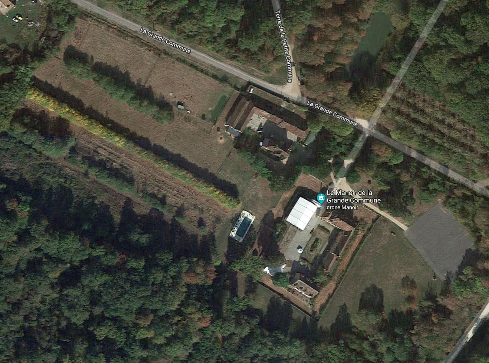


### Lidar Data acquisition

3D Lidar data was captured by a DJI Matrice 600 with a Velodyne VLP-16 on board, with RTK GPS system.

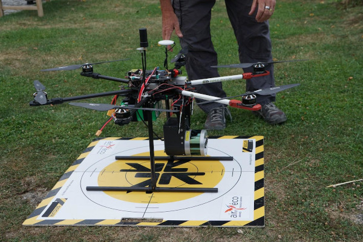
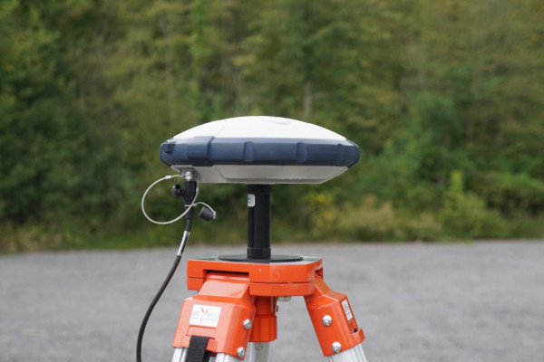

### Photogrammetry images acquisition

For photogrammetry oriented pictures, we used an Anafi drone with the Pix4D app that lets us make one grid and two orbits above the field we wanted to scan. We also used a personal DSLR (Sony alpha-6000) for additional photo.

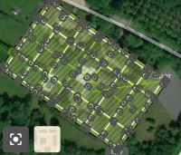
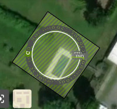
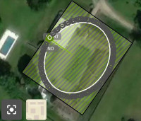

Here is a vizualisation of the resulting point cloud :

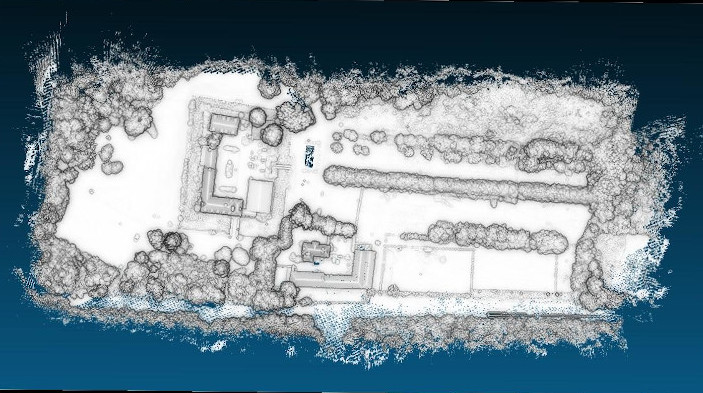
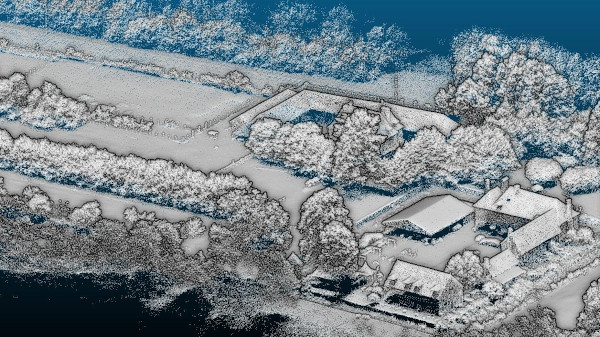

### Piloting videos acquisition

We took videos a two different quality settings : 
 - 4K, 30fps very good quality
 - 720p, 120 fps bad quality (but high framerate)

We have 65k frames in total.

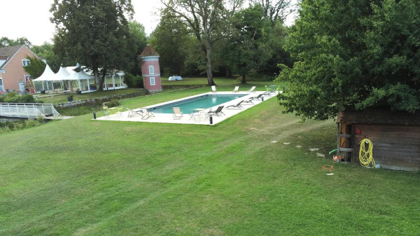
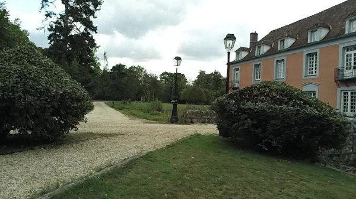

### Optimal video sampling

The first image shows the video localisation with each other according to anafi metadata. (made with COLMAP gui)
The second image shows the frames that have been kept in order to stay at 1000 frames with an optimal spatial sampling.

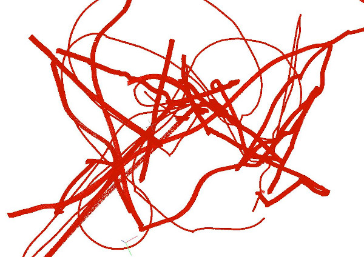
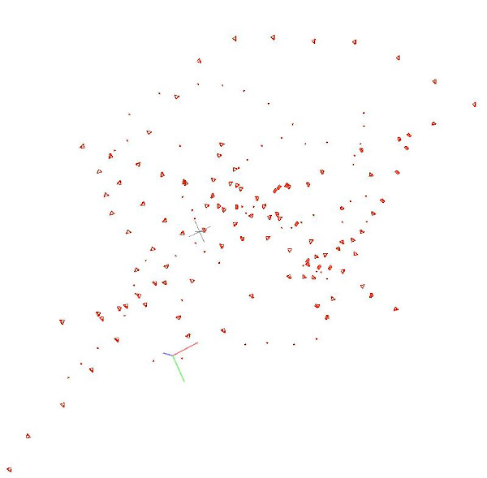

### Thorough photogrammetry

Thorough photogrammetry was done with 1000 frames. Notice that not all the area was mapped. It is expected to be completed once we take care of each video.


### Video localisation

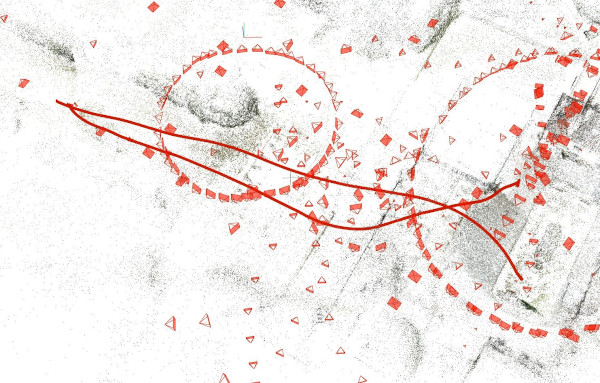

### Dataset inspection

 - First image : black and white drone image
 - Second image : depth map vizualisation
 - Third image : Occlusion depth map

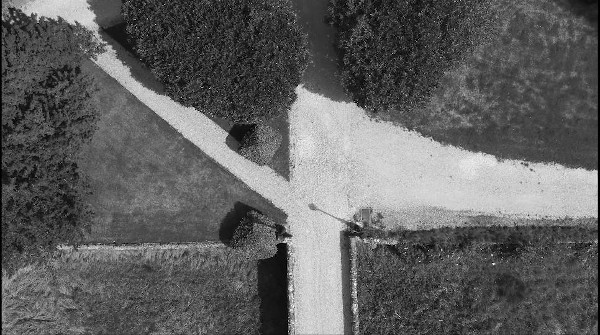
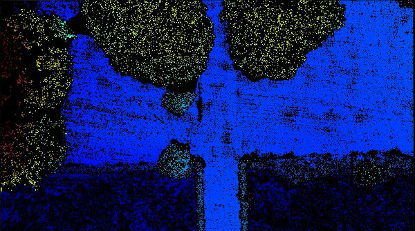
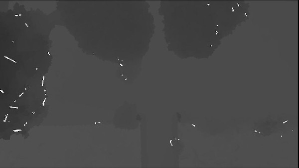

### Resulting video

[](https://www.youtube.com/watch?v=NLIvrzUB9bY&list=PLMeM2q87QjqjAAbg8RD3F_J5D7RaTMAJj)

#Todo

## Better point cloud registration

- See `bundle_adjusment.py` : add chamfer loss to regular bundle adjustment, so that the reconstruction not only minimizes pixel reprojection but also distance to Lidar Point Cloud

## Better filtering of models :

- for now we can only interpolate everything or nothing, add a threshold time above which we don't consider the pose interpolation reliable anymore, even for odometry
- (not sure if useful) add camera parmeters filtering and interpolation, could be used when smooth zoom is applied

## Dataset homogeneization

- Apply rectification on the whole dataset to only have pinhole cameras in the end
- Resize all frames to have the exact same width, height, and intrinsics for particular algorithm that are trained on a specific set of intrinsics (see DepthNet)
- Divide videos into sequential subparts so that each folder will contain subsequent frames with valid absolute pose and depth
